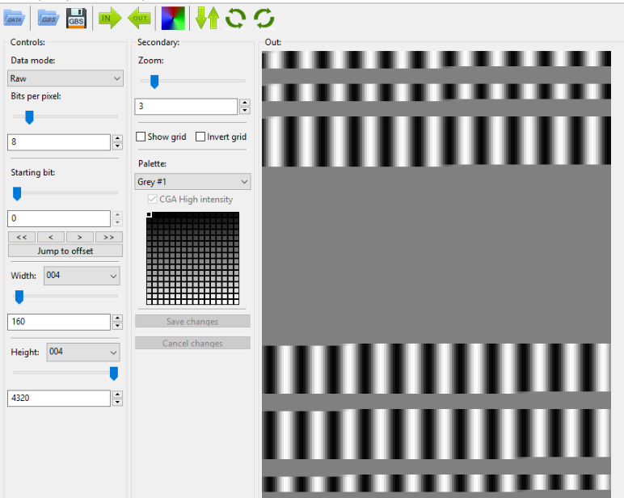

# Raw: Write-up

Утилиты для распознавания форматов файлов (типа `file`) и поиска строк (типа `strings`)
ничего полезного не дают. Не удается и извлечь что-либо из этого файла.

Однако, можно попытаться открыть этот файл как картинку или аудиофайл из чистых данных.

Например, картинка может получиться, если считать каждый байт одним пикселем черно-белой
картинки (или каждые три байта — R, G и B-компонентами очередного пикселя).

А аудиофайл, если считать каждый байт (или несколько подряд идущих байт) одним семплом 
(то есть значением амплитуды).

Для получения картинки можно использовать графический редактор Gimp или забавную
тулзу [GBS](https://www.old-games.ru/forum/threads/gbs.59696/). Открыв данные там, 
получаем очень забавный результат:

О чём это может сказать? О том, что мы скорее всего ошиблись с выбором. У нас очень
много интервалов байт `0x80` (серый цвет) и заметные полосы, которые «переливаются»
между `0x00` (черным) и `0xFF` (белым), причем ширина полос бывает только двух видов:
длинная и короткая.

Наверное, это звук — тогда `0x80` будет соответствовать тишине, а полосы — синусоиде 
или чему-нибудь подобному.

Открываем в Audacity или Adobe Audition. Можно послушать, но всё уже понятно и так.

Осталось декодировать азбуку Морзе.

Флаг: **ugractfmorsecodeissimpletodecode**
